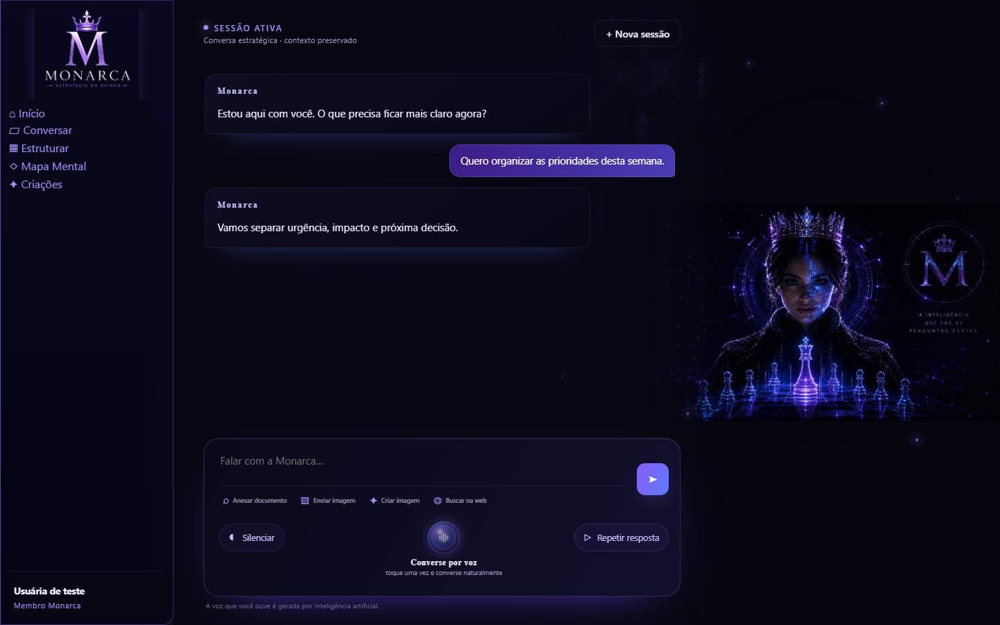
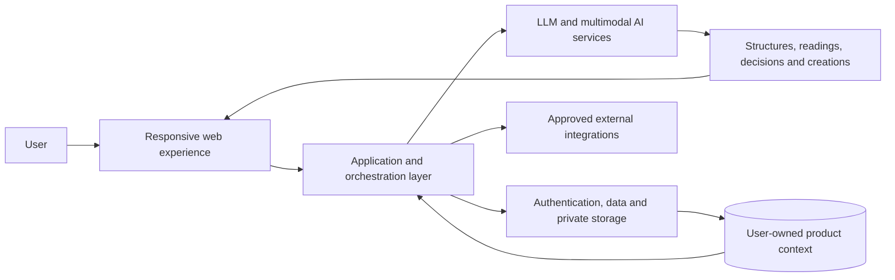
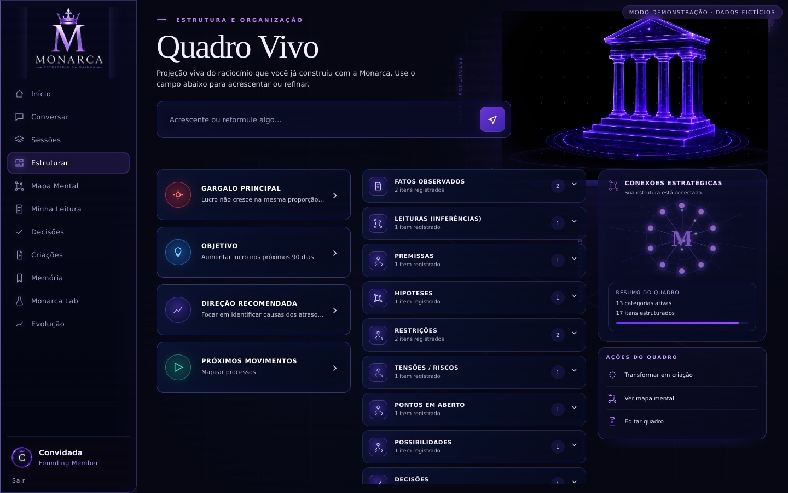
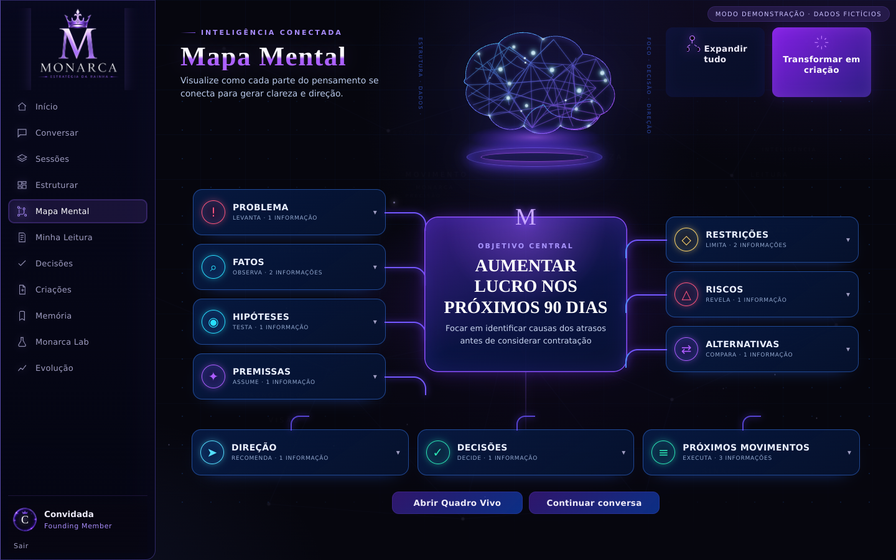
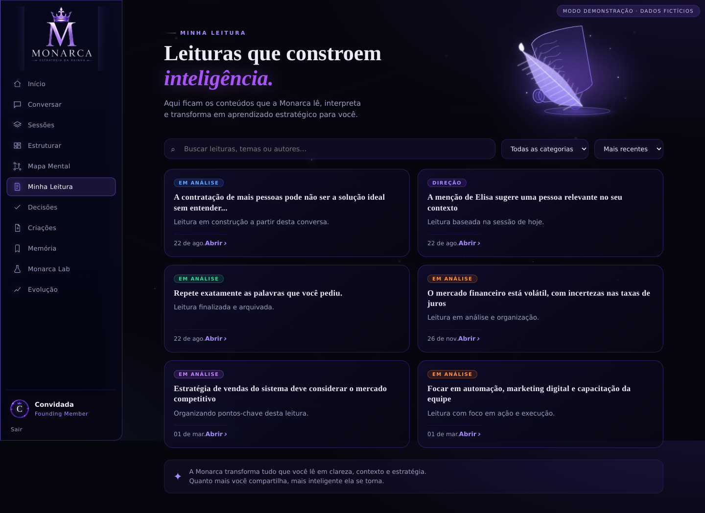
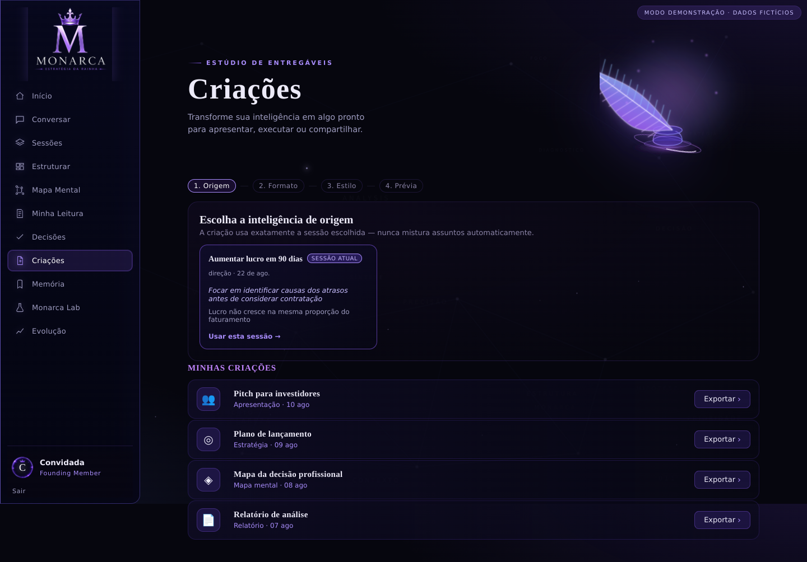

# Monarca AI

### From business context to clearer decisions and practical execution

**Product case study · AI product engineering · Full product lifecycle**

[Visit Monarca AI](https://monarcaai.com.br/)

> This is a public, documentary case study. It presents the product, my role and selected engineering decisions without publishing proprietary source code, prompts, customer data or sensitive architecture.

## Problem

Business owners often carry critical context across disconnected conversations, documents, tasks and decisions. Generic AI chat can help in the moment, but it rarely preserves the structure required to turn that context into a coherent operating view.

Monarca AI was created to reduce that gap: bring scattered business context into one guided experience, organize it and help the user move from reflection to decision and execution.

## Product vision

Monarca is designed as a context-aware workspace rather than a single-prompt assistant. Conversation is the entry point; the product then turns what it learns into structured views, connected reasoning, readings, decisions and reusable deliverables.

The product vision is to make AI useful throughout an ongoing business process—not only at the moment a response is generated.

## What I built

I led Monarca from product definition through implementation and operation, combining product strategy, experience design and software engineering.

The work includes:

- a responsive conversational product for text, voice and multimodal interactions;
- persistent product context and memory across the user's journey;
- structured workspaces that turn conversation into organized business reasoning;
- visual representations of relationships between facts, hypotheses, risks, decisions and next steps;
- workflows for readings, decisions and generated deliverables;
- authentication, commercial access and user-specific data flows;
- serverless AI orchestration, third-party integrations and production release operations;
- automated regression tests, browser validation and staged release candidates.

## Key product capabilities

### Conversar

A contextual conversation workspace designed to collect inputs, maintain continuity and connect text, voice, documents, images and web-assisted work through a consistent product experience.

### Quadro Vivo / Estruturar

A structured view of the business context. It organizes facts, premises, hypotheses, restrictions, risks, possibilities, decisions and next movements so the user can inspect and refine the reasoning behind a direction.

### Mapa Mental

A visual model of how the central objective connects to the evidence and decisions around it. It gives users a faster way to understand the system of relationships created during the work.

### Minha Leitura

A dedicated layer for interpretations derived from the user's context. Readings remain visible and searchable instead of disappearing inside a conversation history.

### Criações

A workflow that turns accumulated context into practical deliverables. The product keeps the source context explicit so generated outputs remain connected to the work that preceded them.

## High-level architecture

The diagram below is intentionally simplified. It communicates the product boundaries without exposing internal services, schemas, prompts or security policies.

### General product flow

## Technology stack

| Area | Technologies and practices |
| --- | --- |
| Product experience | Responsive web UI, progressive enhancement, PWA foundations |
| Application | JavaScript, modular frontend flows, serverless backend services |
| AI | OpenAI APIs, conversational and multimodal workflows, realtime voice foundations |
| Data and identity | Supabase, PostgreSQL, authentication, private storage, row-level access controls |
| Delivery | Netlify, staged release candidates, environment-based configuration |
| Quality | Automated regression tests, contract checks, browser validation, deterministic integration doubles |

## Product screenshots

All screens below use demonstration or test data. No customer records or private account information are shown.

### Quadro Vivo / Estruturar

### Mapa Mental

### Minha Leitura

### Criações

## Engineering challenges

### Keeping context useful over time

The core challenge was not simply generating responses. It was preserving useful context across sessions while keeping each user's information isolated and making the resulting knowledge visible in the interface.

### Making multiple interaction modes feel like one product

Text, voice, documents and images can easily become separate technical features. I designed them around the same conversation and product state so the user can move between modes without losing continuity.

### Handling long-running AI work

Some AI operations take longer than a conventional request cycle. Later release candidates introduced asynchronous processing patterns, explicit states and recovery paths so the interface can remain responsive while work continues. Production validation of the latest image workflow is still in progress.

### Protecting user and commercial boundaries

Authentication, membership, private storage and user-scoped data access were treated as product architecture concerns—not as a layer added after the experience was built.

### Evolving without breaking the core

As voice, multimodal work, integrations and operational tools were added, release candidates were checked against the existing product surface to reduce regressions across core conversation, access and data flows.

## Testing & reliability

Validation has included:

- automated regression suites across core product and integration contracts;
- syntax and contract checks for changed application services;
- browser-level validation across desktop and mobile viewports;
- deterministic test doubles for external providers when real services were intentionally not used;
- authenticated and user-isolation checks around private data flows;
- staged release-candidate reviews with explicit go/no-go decisions.

The evidence is kept intentionally precise: automated or local validation is not presented as production proof, and capabilities awaiting real-service validation remain marked as in evolution.

## Production & operations

Monarca has a live public presence and has gone through real deployment and operating cycles. The production work includes commercial access, authenticated product flows, incident diagnosis, regression control and staged release decisions.

Later capabilities are released only after the required environment and end-to-end checks. For example, the most recent asynchronous image workflow passed its local automated regression suite but remains pending controlled preview and real-service validation before production approval.

No uptime, user or revenue metrics are published in this case study.

## My role

**Founder & AI Product Engineer**

I was responsible for:

- product strategy, positioning and scope;
- user journeys, interaction design and interface direction;
- application architecture and full-stack implementation;
- LLM, voice, document, image and integration workflows;
- data, authentication and commercial-access design;
- testing strategy, release validation and production operations;
- translating real business needs into product decisions and engineering work.

## Key learnings

- An AI product becomes more valuable when generated intelligence is structured and reusable, not trapped in a chat transcript.
- Memory needs product rules, provenance and user boundaries; storage alone is not enough.
- Voice and multimodal inputs should share the same product context instead of creating parallel experiences.
- Slow AI operations require explicit states, asynchronous patterns and honest recovery paths.
- Reliable iteration depends on separating what is built, what is tested and what is actually operating in production.

## Product status

| Status | Scope |
| --- | --- |
| **Built and operated** | Core product experience, contextual conversation, structured views, authenticated access and production release workflows |
| **Built and validated in release candidates** | Realtime voice foundations, multimodal composer flows, persistent-memory improvements and responsive/PWA foundations |
| **In evolution** | Controlled production validation for asynchronous image work, installable PWA validation and additional external integrations |
| **Kept private** | Proprietary source code, prompts, internal schemas, security policies, credentials, customer data and sensitive infrastructure details |

## Explore Monarca AI

Visit the public product website: **[monarcaai.com.br](https://monarcaai.com.br/)**

---

Built by **Carolliny Soares** · Founder & AI Product Engineer

